# Laporan Praktikum Basis Data - Pertemuan 01

**Nama:** Aditya Rizaldiansyah    **NIM:** 25430001    **Kelas:** A    **Tanggal:** 6 Oktober 2026

**Dosen:** Dedi Irawan S.kom M.Ti

## 1. Tujuan Praktikum

Melalui praktikum pertemuan pertama ini, saya bertujuan untuk:
1. Memahami cara kerja, instalasi, dan konfigurasi awal lingkungan basis data menggunakan MariaDB.
2. Mempraktikkan pembuatan akun pengguna dan manajemen hak akses (privileges) untuk mengamankan server basis data.
3. Membiasakan diri mengeksekusi perintah SQL secara langsung melalui Terminal/Command Line Interface (CLI), bukan sekadar mengandalkan antarmuka grafis.
4. Menerapkan penggunaan version control (Git) untuk merekam, melacak, dan mengelola perubahan pada skrip basis data yang saya kerjakan.

## 2. Ringkasan Dasar Teori

Dari materi yang saya pelajari, basis data adalah tempat penyimpanan sekumpulan data yang diatur sedemikian rupa agar mudah dikelola dan dipanggil kembali. Pada praktikum ini, saya menggunakan MariaDB, yaitu sebuah sistem manajemen basis data relasional (RDBMS) yang merupakan percabangan (fork) dari MySQL.

Hal krusial yang saya pahami dari pertemuan ini adalah keamanan server basis data. Secara bawaan, akun tertinggi (`root`) sangat rentan jika tidak diamankan. Oleh karena itu, penerapan prinsip pembatasan hak akses (*least privilege*) sangat ditekankan. Artinya, kita harus membuat akun pengguna biasa dan hanya memberikan izin (`GRANT`) pada database tertentu yang relevan dengan pekerjaan pengguna tersebut. Selain itu, saya juga belajar menggunakan Git untuk mencatat setiap iterasi pengembangan skrip SQL agar pekerjaan lebih terstruktur dan riwayat kodenya aman.

## 3. Hasil Langkah Percobaan

**D.1 Menjalankan MariaDB**

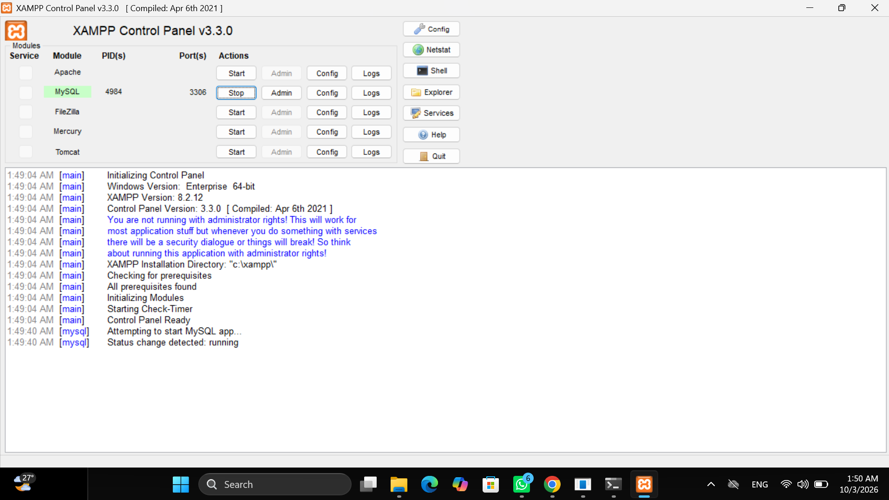

Langkah pertama yang saya lakukan adalah mengaktifkan layanan MariaDB melalui panel kontrol XAMPP. Indikator modul MySQL berubah menjadi hijau beserta munculnya nomor *port* 3306, yang menandakan server basis data saya sudah aktif dan siap menerima perintah.

**D.3 Password root (Titik Analisis 2)**

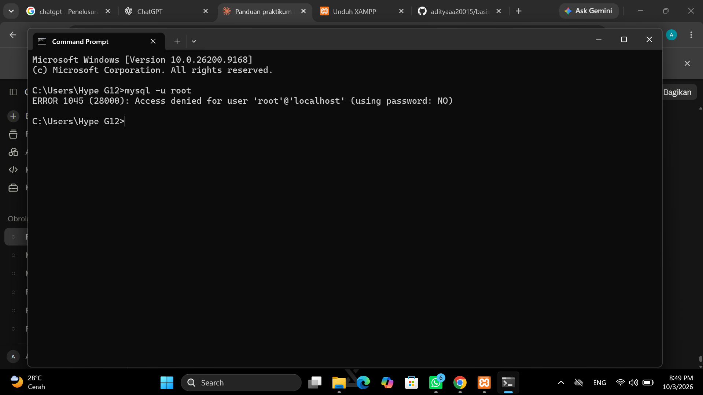

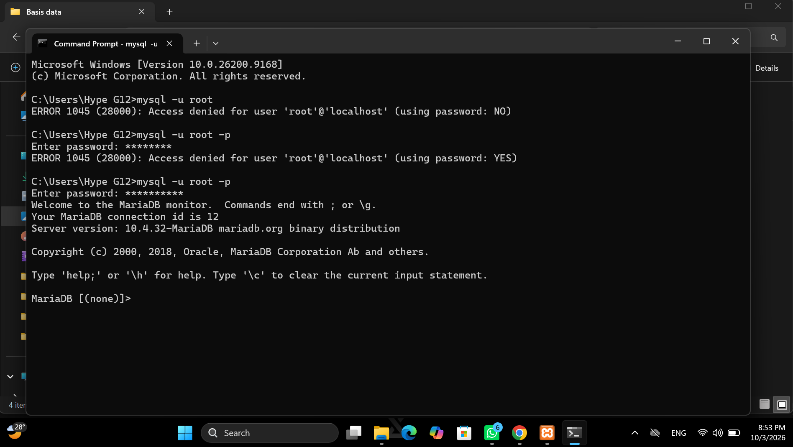

Saat saya mencoba masuk menggunakan akun `root`, saya menemui kegagalan koneksi (*error 1045*). Pada gambar pertama, server menolak akses karena saya mencoba masuk tanpa mendeklarasikan *password*. Sedangkan pada gambar kedua, penolakan terjadi karena *password* yang saya ketikkan salah atau tidak sesuai dengan yang ada di sistem.

**D.4 Basis data dan akun kerja (Titik Analisis 3)**

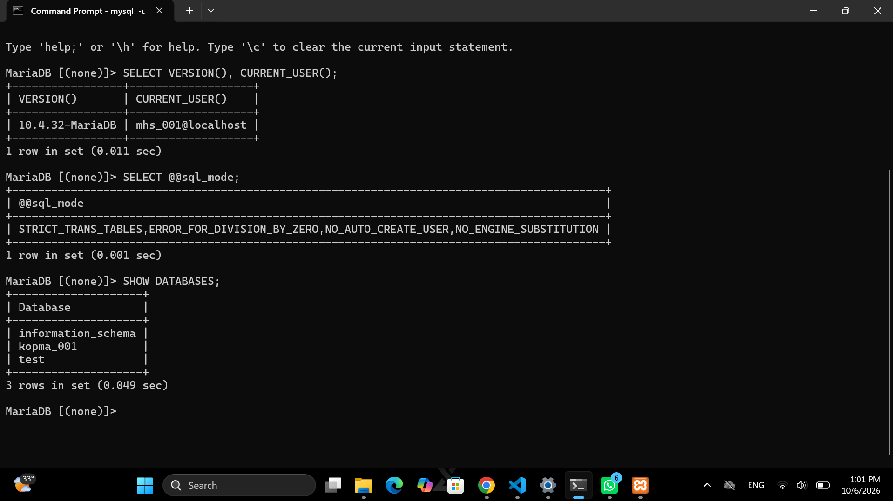

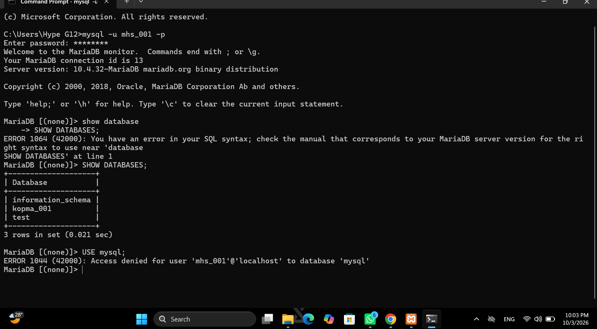

Saya mencoba membuat akun pengguna (*user*) biasa dan mengikatnya hanya pada satu basis data spesifik. Saat saya menguji akun tersebut untuk masuk ke basis data yang menjadi haknya, kueri berjalan lancar. Namun, ketika saya iseng mencoba mengakses basis data lain yang izinnya tidak pernah diberikan kepada akun tersebut, MariaDB langsung memblokir perintah saya dan memunculkan galat 1044.

**D.5 phpMyAdmin mode cookie (Titik Analisis 4)**

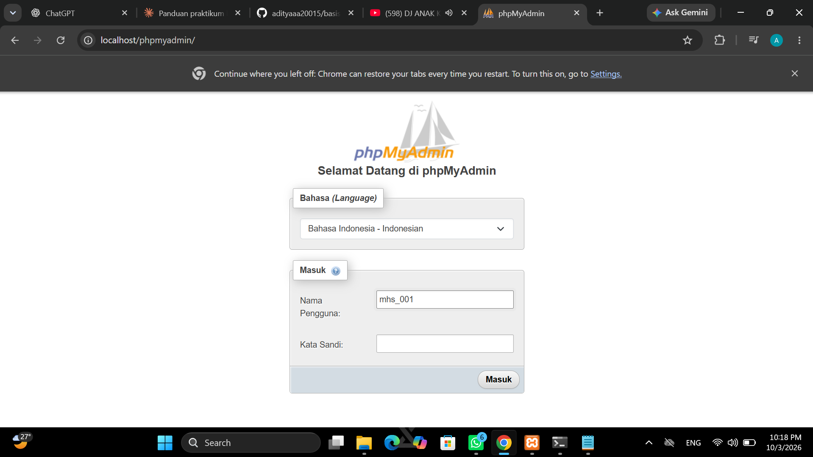

Saya melakukan perubahan konfigurasi pada file phpMyAdmin agar sistem autentikasinya menggunakan mode *cookie*. Hasilnya, seperti pada tangkapan layar, saya sekarang diwajibkan untuk melewati halaman *login* dengan memasukkan *username* dan *password* sebelum bisa melihat panel dasbor, yang mana ini jauh lebih aman.

**D.6 Repositori Git**

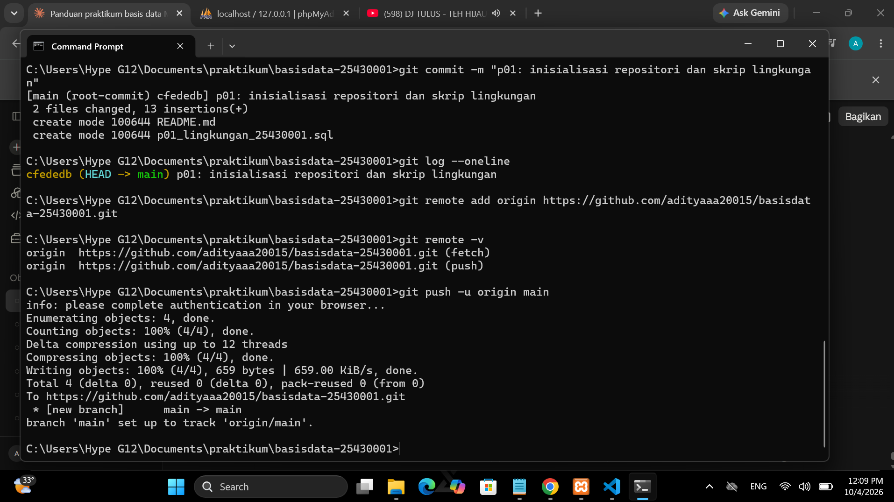

Saya menginisialisasi repositori Git secara lokal pada folder kerja saya, kemudian menautkannya ke GitHub. Setelah melakukan proses penambahan (`add`) dan pencatatan (`commit`), saya berhasil mendorong (`push`) skrip tugas saya ke *branch* utama (main) di GitHub tanpa ada error.

## 4. Jawaban Titik Analisis

**Titik Analisis 1**

Menurut pemahaman saya, menggunakan akun `root` secara terus-menerus untuk segala aktivitas database sangatlah berbahaya. Akun `root` adalah Superuser yang bisa melihat, mengubah, dan menghapus seluruh konfigurasi server maupun semua database yang ada. Jika terjadi salah ketik perintah (*human error*) atau akun ini disusupi, seluruh sistem bisa hancur. Dengan memecah akses ke pengguna-pengguna kecil (penerapan *Least Privilege*), kerusakan atau kebocoran data dapat dilokalisasi hanya pada basis data milik pengguna tersebut.

**Titik Analisis 2**

Kode galat `1045 (28000): Access denied for user` saya temukan saat tahap awal mencoba masuk/koneksi ke MariaDB. Galat ini murni karena masalah autentikasi. Penyebabnya ada dua: saya lupa menambahkan opsi `-p` saat akun tersebut sebenarnya memiliki kata sandi, atau saya salah mengetikkan kata sandi. Intinya, server tidak mengenali identitas kredensial saya.

**Titik Analisis 3**

Saya mendapatkan galat `1044 (42000): Access denied for user` ketika saya (menggunakan akun biasa) sudah berhasil *login* to MariaDB, namun saya mencoba memanggil perintah `USE nama_database` pada database yang aksesnya tidak diizinkan untuk akun saya. Hal ini membuktikan bahwa pembatasan hak akses yang diset oleh `root` bekerja dengan baik.

**Titik Analisis 4**

Perbedaan utama antara phpMyAdmin mode `cookie` dan `config` ada pada cara penyimpanan kredensial. Pada mode `config`, *username* dan *password* kita tanam mati di dalam skrip `config.inc.php`, sehingga phpMyAdmin akan langsung terbuka tanpa perlu *login*. Ini sangat rentan jika laptop kita dipinjam orang. Sedangkan pada mode `cookie`, kredensial tidak disimpan di skrip. Kita dipaksa mengisi *form login* setiap membuka phpMyAdmin, dan sesi kita hanya disimpan sementara waktu (*session token*) di peramban web kita. Mode *cookie* mutlak lebih aman.

| Aspek | Mode `config` | Mode `cookie` |
| :--- | :--- | :--- |
| **Penyimpanan Kredensial** | Ditulis langsung di file `config.inc.php` | Disimpan sementara sebagai *session token* di browser |
| **Proses Akses** | Otomatis masuk tanpa halaman *login* | Wajib mengisi *username* & *password* di halaman *login* |
| **Tingkat Keamanan** | Sangat rentan (siapa saja bisa membuka dasbor) | Lebih aman (terproteksi autentikasi berulang) |

**Perbedaan kode galat 1044, 1045, dan 1142**

Berdasarkan analisis dan percobaan saya, ketiganya adalah sistem penolakan, namun di level yang berbeda:
- **Error 1045**: Ditolak di "pintu gerbang". Gagal *login* ke server secara keseluruhan karena salah *password*.
- **Error 1044**: Sudah masuk gerbang, tapi ditolak masuk ke "gedung" tertentu. Akun bisa *login*, tapi dilarang mengakses keseluruhan sebuah basis data.
- **Error 1142**: Sudah masuk ke gedung, tapi dilarang melakukan aksi tertentu. Akun bisa membuka database dan melihat isinya, namun saat mencoba mengubah/menghapus data, perintahnya ditolak karena izinnya dibatasi (misal: hanya boleh `SELECT`, tidak boleh `INSERT`/`DELETE`).

| Kode Galat | Level Penolakan | Analogi Akses | Penyebab Utama |
| :---: | :--- | :--- | :--- |
| **1045** | **Server / Autentikasi** | Ditolak di pintu gerbang luar | Salah *password* atau lupa opsi `-p` saat *login* |
| **1044** | **Database / Otorisasi** | Ditolak masuk ke gedung tertentu | Menjalankan `USE db` pada database yang tidak diizinkan |
| **1142** | **Tabel / Hak Akses Perintah** | Ditolak melakukan aksi di dalam ruangan | Menjalankan perintah `INSERT`/`DELETE` saat hanya diizinkan `SELECT` |

## 5. Hasil Latihan dan Modifikasi

**E.1 Akun tamu_001**

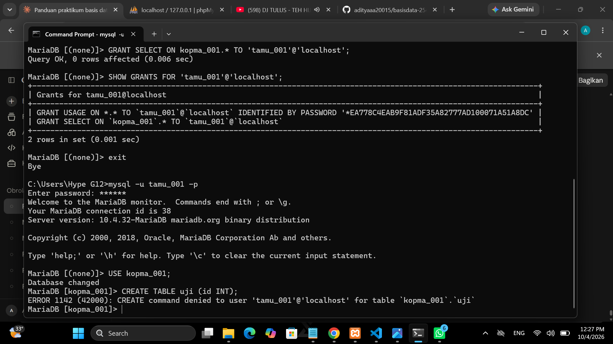

Untuk memperdalam pemahaman, saya membuat akun `tamu_001` dan mengatur agar ia hanya memiliki akses membaca (`SELECT`). Ketika saya mencoba memasukkan data baru menggunakan perintah `INSERT` dari akun tamu ini, sistem langsung mengenali pelanggaran hak akses dan memunculkan galat 1142, yang berarti integritas data saya terjaga dari pengguna yang tidak berhak memodifikasinya.

**E.2 Skrip dapat dijalankan ulang**

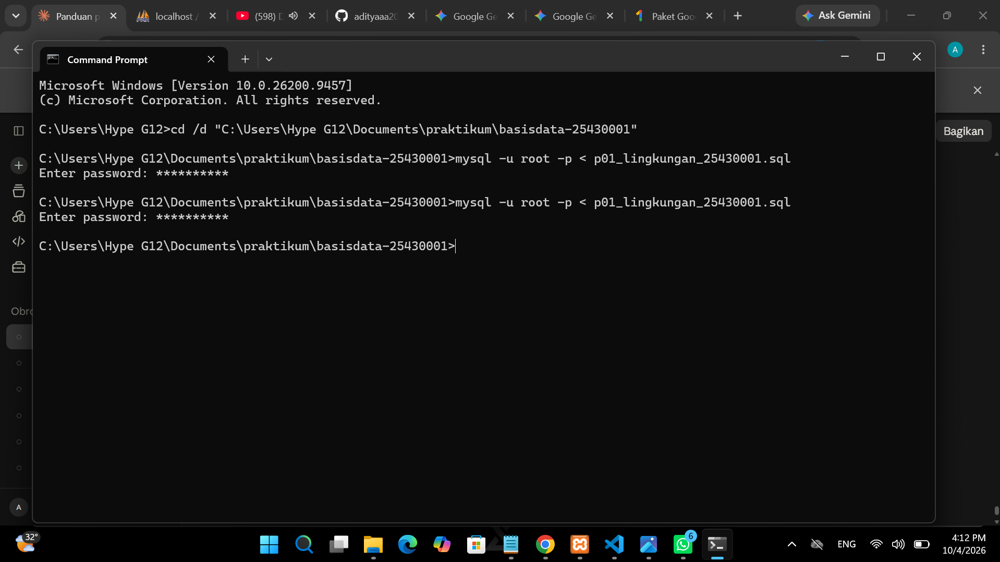

Sebelumnya, jika saya mengeksekusi skrip SQL yang sama dua kali, terminal akan eror karena tabel atau database sudah ada. Saya kemudian memodifikasi skrip tersebut dengan klausa `DROP DATABASE IF EXISTS` (untuk membersihkan database lama) dan `CREATE DATABASE IF NOT EXISTS`. Dengan modifikasi ini, skrip saya menjadi *idempotent*; bisa saya jalankan puluhan kali di terminal tanpa memunculkan pesan galat sedikitpun.

## 6. Tugas Mandiri: Milestone Proyek 01

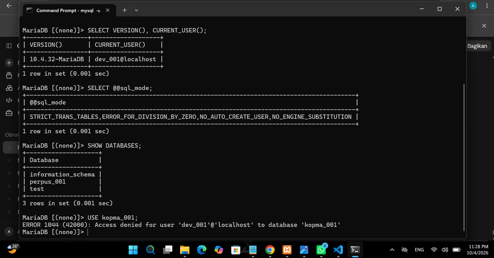

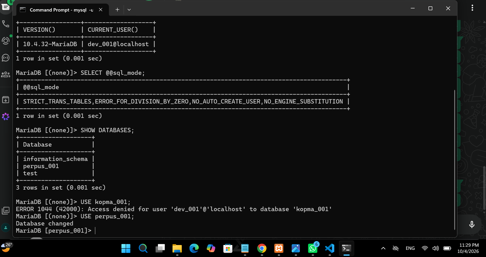

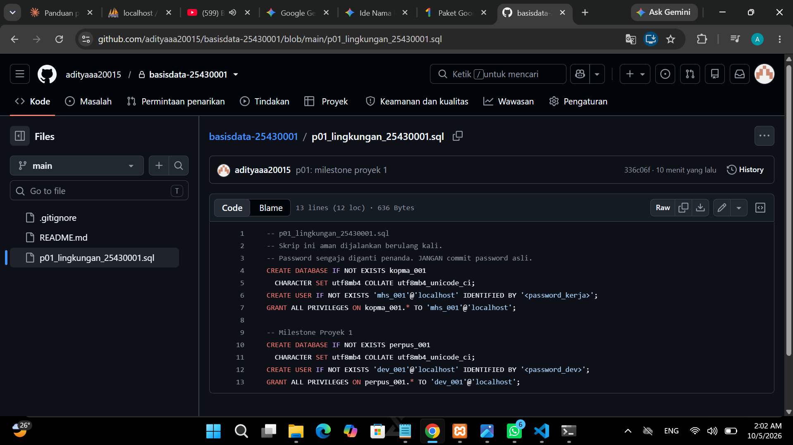

Untuk menyelesaikan Milestone 01, saya telah membuat ruang kerja proyek terpisah. Saya menyusun struktur basis data proyek akhir dan mendaftarkan akun *developer* khusus untuk menangani basis data tersebut. Untuk memastikan pengaturannya benar, saya mengetes akun proyek ini untuk mengakses basis data tugas lain (Kopma), dan server berhasil menolaknya (membuktikan isolasi akses berfungsi). Semua file inisiasi proyek pertama ini juga sudah saya amankan ke repositori GitHub pribadi saya.

## 7. Pembahasan dan Kendala

Secara praktik, materi minggu ini cukup mudah dicerna secara logika. Namun, kendala utama yang saya rasakan adalah beradaptasi dengan lingkungan CLI/Terminal. Menuliskan kueri SQL lewat terminal mensyaratkan ketelitian tinggi pada sintaks dan tanda baca (seperti tanda titik koma di akhir kueri). Selain itu, saya sempat kesulitan saat mengonfigurasi Git ke GitHub karena GitHub kini mewajibkan penggunaan *Personal Access Token* (PAT) alih-alih *password* akun biasa. Setelah saya mencari referensi di dokumentasi GitHub dan menempelkan token tersebut, proses *push* akhirnya berjalan sukses.

## 8. Kesimpulan

Kesimpulan yang saya ambil dari praktikum kali ini adalah pengelolaan basis data tidak hanya soal menyimpan data, tetapi juga tentang pengamanan dari tingkat dasar. Melalui MariaDB, saya jadi tahu bagaimana memproteksi pintu utama (`root`), membuat pengguna lapis kedua, dan menyekat hak akses masing-masing pengguna secara spesifik. Ditambah dengan integrasi Git, alur kerja saya menjadi lebih profesional karena saya bisa melacak riwayat perubahan struktur database dengan rapi dan mendeteksi kesalahan skrip jauh lebih cepat.

## 9. Pernyataan Penggunaan AI

Saya menyatakan bahwa pemikiran, analisis galat, dan eksekusi instruksi pada laporan ini murni hasil pemahaman dan percobaan saya sendiri selama praktikum. Saya memanfaatkan bantuan *Artificial Intelligence* (AI) sebatas sebagai asisten editor untuk memperbaiki kesalahan ejaan (typo), menyelaraskan pilihan kata, dan merapikan format penyajian dokumen Markdown agar penjelasan teknis saya lebih mengalir, terstruktur, dan mudah dibaca tanpa mengubah fakta hasil praktikum saya.

## 10. Bukti Git

- Repositori: https://github.com/adityaaa20015/basisdata-25430001
- Commit pertama: `cfededb` (p01: inisialisasi repositori dan skrip lingkungan)
- Commit milestone: `336c06f` (p01: milestone proyek 1)

## Checklist

- [✓] Identitas
- [✓] Tujuan
- [✓] Ringkasan teori
- [✓] Langkah percobaan (D)
- [✓] Titik Analisis
- [✓] Latihan (E)
- [✓] Tugas Mandiri (F)
- [✓] Pembahasan dan kendala
- [✓] Kesimpulan
- [✓] Pernyataan Penggunaan AI
- [✓] Bukti Git
- [✓] Keaslian
- [✓] Berkas wajib
- [✓] Bukti tangkapan layar
- [✓] Analisis wajib